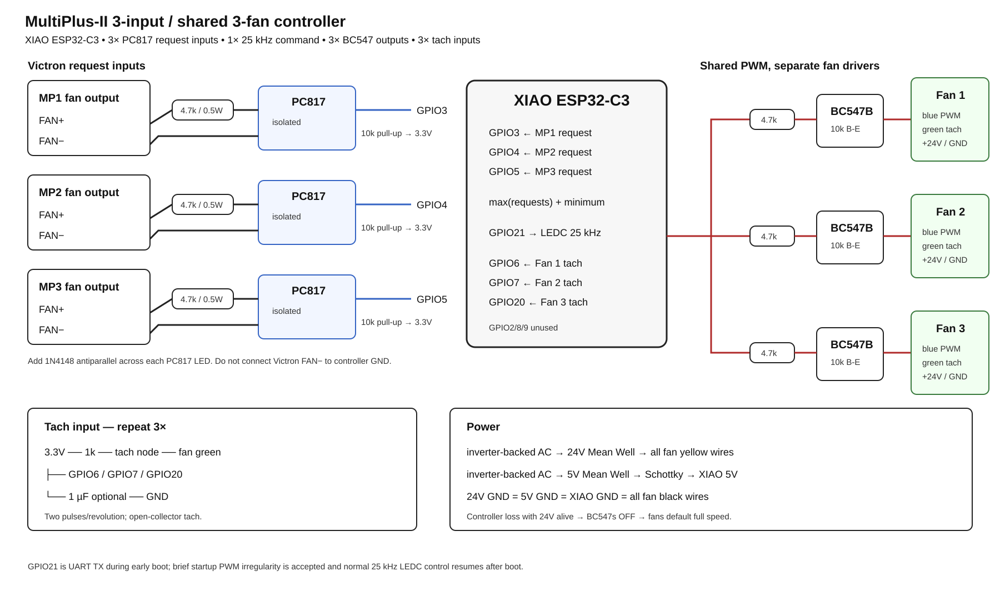

# Victron MultiPlus-II 3-input / shared 3-fan controller

ESPHome controller for up to three Victron MultiPlus-II units using one
**Seeed Studio XIAO ESP32-C6** and three 24 V 4-wire Noctua fans.

The controller reads the three original MultiPlus fan requests independently,
selects the highest request, applies a configurable minimum speed, then sends
one shared speed command to all three fans.

All three fans therefore run at the same commanded speed. Each fan keeps its
own tachometer channel so failures can still be detected independently.

## Hardware overview



## Home Assistant entities

**Requests**
- `MP1 Victron Fan Request`
- `MP2 Victron Fan Request`
- `MP3 Victron Fan Request`
- `Highest Victron Fan Request`

**Control**
- `Fan Mode` — Auto / Manual / Full Speed
- `Fan Speed` — live shared command and manual slider
- `Minimum Fan Speed` — Auto-mode floor

Moving `Fan Speed` from Home Assistant automatically changes `Fan Mode` to
Manual. Select Auto to return control to the MultiPlus requests.

**Feedback**
- `MP1 Fan RPM`
- `MP2 Fan RPM`
- `MP3 Fan RPM`
- `MP1 Fan Fault`
- `MP2 Fan Fault`
- `MP3 Fan Fault`

## Pin allocation

| Function | XIAO pin | ESP32-C6 GPIO |
|---|---|---:|
| MP1 request | D1 | GPIO1 |
| MP2 request | D2 | GPIO2 |
| MP3 request | D3 | GPIO21 |
| **Shared 25 kHz fan PWM** | **D4** | **GPIO22** |
| MP1 tach | D5 | GPIO23 |
| MP2 tach | D7 / RX | GPIO17 |
| MP3 tach | D10 | GPIO18 |
| unused UART TX | D6 / TX | GPIO16 |

The selected control pins avoid the ESP32-C6 strapping pins. D6 / GPIO16 is
left unused so the shared fan PWM output is not placed on the XIAO UART-TX pin.

### examples/victron-fan-controller.yaml

```yaml
substitutions:
  name: victron-fan-controller
  friendly_name: Victron Fan Controller
  log_level: INFO

packages:
  remote_package:
    url: https://github.com/Nxt-1/ESPHome-VictronMP-II-FanController
    ref: main
    files:
      - packages/controller.yaml
    refresh: 0s

wifi:
  use_address: 192.168.178.163